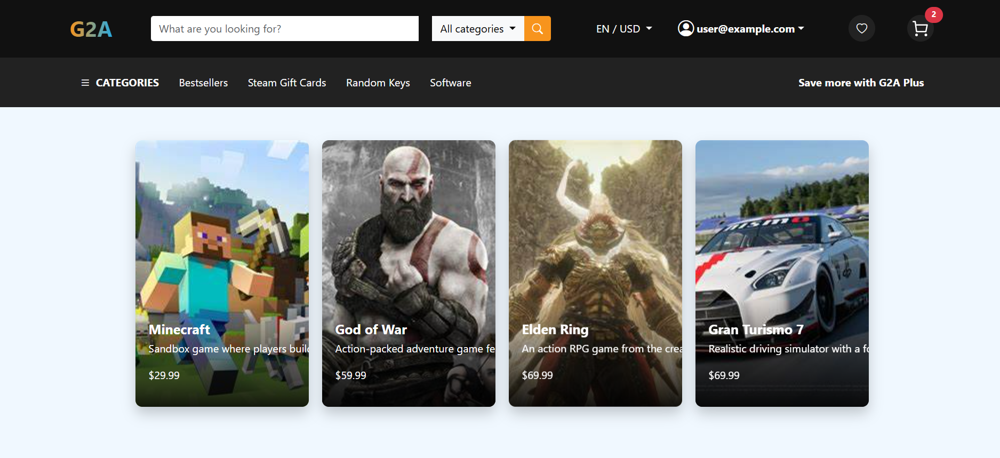

# Game Ecommerce


## Project Setup
### Note: All commands must be run from the ./Ecommerce directory.

## Setup .env
### Rename .env.example to .env and start config

## Development Environment
### 1. Copy the appsettings.example.json file.
### 2. Rename it to:
```sh
appsettings.Development.json
```

## Production Environment
### 1. Copy the appsettings.example.json file.
### 2. Rename it to:
```sh
appsettings.json
```

# Minio Configuration
## -- In appsettings.*.json, if in Development environment, settings like this
```markdown
```json
"MinioSettings": {
  "Endpoint": "localhost:9000",
  "AccessKey": "${MINIO_ROOT_USER}",
  "SecretKey": "${MINIO_ROOT_PASSWORD}",
  "BucketName": "ecommerce-media",
  "UseSSL": false
}
### Note that access key and secret key must get from env file

# VNPAY Configuration
🚧 *This section is currently under development.* 

## -- Deploy to docker -- 
### Build
```sh
docker compose up --build
```
### Run 
```sh 
docker compose up -d 
```

# Entity Framework Core
## -- Add a new migration -- 
```sh
dotnet ef migrations add [Migration-Msg] --project ECommerce.Infrastructure --startup-project ECommerce.API --output-dir Data/Migrations
```

### Replace [MigrationName] with a descriptive name for your migration.

## -- Apply Migrations to the Database --
```sh
dotnet ef database update --project ECommerce.Infrastructure --startup-project ECommerce.API
```

## -- Run seed command --
```sh
cd .\ECommerce.API\
```
```sh
dotnet run seed
```